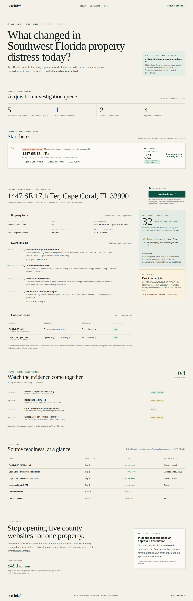

# AcreBrief

**Finding a distressed-property signal is easy. Understanding whether the property deserves an acquisition team's time can require five government systems. AcreBrief does that investigation automatically.**

`source-dated foreclosure registration → exact Florida DOR parcel → evidence-backed brief`



[Open the live product](https://acrebrief.com) · [Read the Cape Coral source monitor](https://acrebrief.com/florida/cape-coral/property-distress) · [Watch the 60–90 second walkthrough](assets/demo/acrebrief-demo.mp4)

AcreBrief is event-driven public-record property intelligence for Southwest Florida. It monitors lawful primary sources, resolves events to parcels, preserves evidence, and explains what is known, calculated, inferred, and unavailable. It is decision support—not a title opinion, valuation, or claim that anybody wants to sell.

## The live proof

Press **Investigate live** on the Cape Coral property. AcreBrief performs a real, bounded run:

1. **Solari Browser** opens Florida DOR's official assessment-roll catalog and verifies source identity.
2. **Solari Sandbox** downloads DOR's current 43 MB `2026P` Lee NAL archive, checks the ZIP entry and size ceilings, decompresses 285 MB in isolation, validates unique required headers, fingerprints the observed 165-column schema, rejects duplicate parcel rows, and emits one privacy-minimized parcel record.
3. The server queries one exact **City of Cape Coral Foreclosure Registration** Open Data record, excluding owner, mailing, contact, and free-text description fields at retrieval.
4. **Solari Sandbox** independently verifies `trim(City.Strap) === DOR.PARCEL_ID`, hashes the evidence manifest, and rejects a non-exact join.
5. AcreBrief renders the City `opened` event clock, City `updated` clock, immutable first-seen observation, current retrieval time, transparent score, and material unknowns.

The selected City record is a real municipal foreclosure registration source-opened August 31, 2026 and marked `REGISTERED` / `Open`. The City says this program applies when a mortgagee has initiated foreclosure on a vacant property. AcreBrief does **not** turn that into a court filing, judgment, auction, title fact, or persisted snapshot diff. The static queue uses an absolute source date; successful current retrieval says `LIVE VERIFIED RESULT`. `NEW_FORECLOSURE_REGISTRATION` and “new since last run” remain reserved for durable prior-state comparison.

The critical live route depends only on sources classified `PUBLIC_DOWNLOAD` or `OPEN_DATA_API`. Business Observer and unapproved Clerk/browser sources remain `REVIEW_REQUIRED` and are never opened by this path.

### The daily event-stream foundation

The additive Cape Coral runner now snapshots privacy-minimized official Code Enforcement, Utility Lien, and Building Permit deltas, with exact-parcel Payoff snapshots for a bounded watchlist. The first run establishes a baseline and emits zero `NEW_*` events; late old rows are updates, never falsely relabeled as new. Each transition records whether its clock came from a source event, source update, or AcreBrief detection.

Production now persists the three-source stream in transactional Neon Postgres and runs it once daily through an authenticated Vercel Cron. The September 1 release established a real baseline (42 code records, 240 permits, zero utility liens) with zero `NEW_*` events; an immediate second invocation loaded generation 1, advanced all three watermarks to generation 2, retained the baseline rows, and emitted zero false transitions. See [Cape Coral event stream](docs/CAPE_CORAL_EVENT_STREAM.md).

## The customer question

> **What changed in Southwest Florida property distress today, and which properties are actually worth investigating?**

The product's canonical unit is a parcel event graph:

```text
official event → exact property key → independent parcel source → evidence timeline
               → transparent score → unresolved questions → human decision
```

Every fact keeps its source URL, retrieval time, effective date, raw privacy-minimized value, normalized value, confidence, evidence reference, and adapter version. Address-only matches remain candidates; only exact native parcel identifiers become high-confidence joins.

## Why Solari is material

- **Browser** makes official source discovery and catalog verification observable. The current run uses a short, non-recorded DOR session; recording remains disabled until retention/deletion and replay review controls exist.
- **Sandbox** does the expensive, security-sensitive work: untrusted archive validation, decompression, 165-column CSV parsing, privacy projection, schema checks, exact cross-source joins, evidence hashing, and score-manifest validation in an isolated microVM.
- **Desktop** is reserved for an approved GUI-only government source. It is not used for an API or to bypass access controls.
- **Persistent profiles** are supported by Solari but intentionally unused because this official path is unauthenticated.

See [Solari architecture](docs/SOLARI_ARCHITECTURE.md) and [unit economics](docs/UNIT_ECONOMICS.md).

## Source policy

`data/source_registry.yaml` is the machine-readable authority. Every source has:

```yaml
access_basis: PUBLIC_DOWNLOAD | OPEN_DATA_API | PAID_LICENSE | EXPRESS_PERMISSION | REVIEW_REQUIRED
```

Only the first four can be production-approved. Generated runtime policy additionally requires exact HTTPS URLs, an accountable reviewer, a terms-review date, an expiry, and a positive per-run request budget. CI rejects drift between the YAML and generated TypeScript policy.

Current `LIVE_READY` chain:

| Source | Access basis | Job |
| --- | --- | --- |
| Florida DOR 2026 preliminary Lee NAL | `PUBLIC_DOWNLOAD` | current official parcel and assessment facts |
| Cape Coral Foreclosure Registration Open Data | `OPEN_DATA_API` | source-dated municipal event, opened/updated clocks, exact STRAP |
| Cape Coral Utility Lien Open Data | `OPEN_DATA_API` | active municipal-lien source status and source event date |
| Lee County parcel/locator REST | `OPEN_DATA_API` | independent exact parcel/address lookup, available as corroboration |

The snapshot adapters additionally live-verify Cape Coral Code Enforcement, Building Permits, and watchlist Payoff. Inspections and 311 remain `REVIEW_REQUIRED`.

See the [source matrix](docs/SOURCE_MATRIX.md) for the review-required alternatives and caveats.

## Quick start

Requires Node 20.9+.

```bash
git clone https://github.com/GDACS-droid/solari-cookbook.git acrebrief
cd acrebrief
npm install
cp .env.example .env.local
npm run dev
```

The verified official-data replay works without credentials. A live run requires `SOLARI_API_KEY`. The public competition deployment additionally opts into the locked one-property route with `ACREBRIEF_PUBLIC_LIVE_DEMO=true`; other environments remain token-gated. Never put secrets in `NEXT_PUBLIC_*`.

```bash
npm run verify
npm run test:e2e
```

Verified on September 1, 2026: source-policy drift check, lint, TypeScript, 66 unit/integration/API/policy tests, production build, 18 desktop/mobile E2E tests locally and again against `acrebrief.com`, zero known production dependency vulnerabilities, two authenticated real source runs proving cross-invocation durability/deduplication, and a production Solari Browser + Sandbox run that completed the DOR→City foreclosure-registration exact parcel join.

## Safety and limits

- No CAPTCHA bypass, authentication evasion, publisher scraping, broad party search, or mass outreach.
- No owner, customer, account, mailing, phone, or email fields in the public graph.
- The DOR roll is preliminary and assessment just value is not an AVM, current market price, or equity estimate.
- A City `FORECLOSURE REGISTRATION` row is evidence of a municipal registration—not the underlying court filing date/number, lien priority, payoff, title condition, current tax delinquency, or seller intent.
- Scores triage investigation effort. Missing data remains explicitly unavailable and never becomes zero.

Read [privacy and compliance](docs/PRIVACY_AND_COMPLIANCE.md), [security](docs/SECURITY.md), and the [sample official-data report](docs/SAMPLE_INVESTIGATION_REPORT.md).

## Commercial thesis

Primary users are acquisition teams, investor/broker teams, wholesalers, and property-data organizations. The wedge is not “another pre-foreclosure list.” It is:

> **AcreBrief autonomously investigates changes across fragmented primary sources, resolves them into a parcel event graph, preserves the proof, and surfaces the few records worth a human's next hour.**

Founding hypothesis: **$750–$1,500/month for a concierge design-partner pilot**, with a $500 two-week paid beta as a low-friction validation option. The customer supplies a real buy box; AcreBrief delivers a small set of source-backed investigations. No pilots, testimonials, or usage are fabricated. The production form is backed by Postgres, requires explicit follow-up consent, deduplicates email submissions, uses a honeypot, and enforces a durable five-attempt/15-minute rate limit. See the [founding pilot package](docs/FOUNDING_PILOT.md), [product definition](docs/PRODUCT.md), and [competitive analysis](docs/COMPETITIVE_ANALYSIS.md).

## Challenge basis

Built for the Pinetree Research / Solari challenge referenced by Harry Chow ([post 1](https://x.com/harrychow_/status/2094521275586691410), [post 2](https://x.com/harrychow_/status/2094437473912844480)). The exact official basis is [`solari-sdk/solari-cookbook`](https://github.com/solari-sdk/solari-cookbook); this repository is its public fork with the upstream remote retained.

- [60–90 second demo script](docs/DEMO_SCRIPT.md)
- [Launch copy—draft only; do not publish without approval](docs/LAUNCH_COPY.md)
- [Architecture and decisions](docs/SOLARI_ARCHITECTURE.md)
- [Build log](docs/BUILD_LOG.md)
