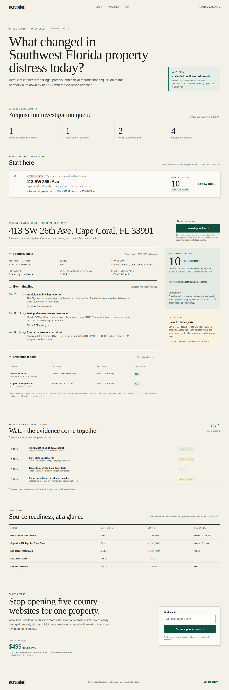

# AcreBrief

**Finding a pre-foreclosure is easy. Understanding whether it deserves an acquisition team's time can mean checking five county systems. AcreBrief does that investigation automatically.**

`2 verified public-record signals → 1 evidence-backed property brief`



[Watch the 72-second verified-fixture walkthrough](assets/demo/acrebrief-demo.mp4) · The live Solari version uses the same UI only after credentials and source approvals are configured.

[Open the public verified-sample preview](https://acrebrief-preview.vercel.app) — no login or Solari credentials required.

AcreBrief is an evidence-first, event-driven public-record property intelligence product for Southwest Florida. It watches lawful public sources for changes, resolves them to a parcel, and creates a concise investigation brief with source links, confidence, and an explainable score. It is decision support—not a claim that an owner is distressed, willing to sell, or that a title is clear.

> **Competition build status:** Lee County is the vertical slice. The product has a **verified-sample** mode for a safe, reproducible public demo and an **authorized live** mode that requires a Solari key, a demo access token, and an explicit server-side source allow-list. A live run is deliberately fail-closed when a property-specific source is unavailable, unapproved, or needs review; portal reachability alone never produces a property result.

## The question it answers

> **What changed in Southwest Florida property distress today, and which properties are actually worth investigating?**

Instead of another contact list, AcreBrief is a parcel event graph:

```text
public record change → court/record reference → parcel resolution → corroborating facts
                    → evidence timeline → explainable opportunity score → human decision
```

Every fact carries a source URL, retrieval time, event/effective date, raw and normalized values when applicable, confidence, and adapter version. Uncertain matches stay uncertain and enter review; an LLM is never allowed to turn a weak address/party match into a confident property assertion.

## Why Solari is material

AcreBrief uses Solari as the operating substrate for the hard parts of a live investigation:

- **Browser** works enabled JavaScript-heavy public portals when a documented API/bulk export is not available, can capture reviewed evidence, and records an opt-in replay only for privacy-safe surfaces.
- **Persistent profiles** preserve an explicitly authorized portal session when one is required. They are never committed or exposed in the public UI.
- **Sandbox** currently validates the fresh evidence manifest and independently cross-checks the numeric score in an isolated microVM. Bounded PDF parsing is the next adapter stage, not a capability this slice pretends has already run.
- **Recording** makes approved generic-portal checks auditable. Property-specific pages stay unrecorded because their full text contains unnecessary personal information. Sandbox snapshots are a documented optimization path, not enabled in this slice.
- **Desktop** is intentionally a constrained fallback for a legacy GUI that cannot be reasonably accessed through permitted browser/API retrieval. It is not used to bypass access controls or CAPTCHA.

The detailed design and capability evidence are in [Solari architecture](docs/SOLARI_ARCHITECTURE.md).

## What a reviewer can do

1. Open the dashboard and see newly detected Lee County sample events ranked by priority.
2. Open a property to see its event timeline, unknowns, derived score components, and independent source evidence.
3. Press **Investigate** to watch the run fan out across enabled sources. With `SOLARI_API_KEY`, this uses the live Solari workflow; without it, the clearly labelled verified sample remains available for review.
4. Submit a pilot request. The form captures interest only; it does not invent pilots, testimonials, or usage.

## Quick start

Requires Node 20.9+.

```bash
git clone https://github.com/GDACS-droid/solari-cookbook.git acrebrief
cd acrebrief
npm install
cp .env.example .env.local
npm run dev
```

Visit `http://localhost:3000`. The default public configuration is `NEXT_PUBLIC_DEMO_MODE=verified-sample`.

To enable eligible live investigation surfaces, set a real `SOLARI_API_KEY`, a long `ACREBRIEF_LIVE_ACCESS_TOKEN`, and only the reviewed IDs in `ACREBRIEF_APPROVED_SOURCE_IDS`. The public route is single-concurrency and token-gated so anonymous visitors cannot spend the deployment’s Solari balance. Do not put secrets in `NEXT_PUBLIC_*`, commit them, share a profile, or use them to evade a source's terms, CAPTCHA, login requirement, rate limits, or confidentiality restrictions.

```bash
npm run verify
npm run test:e2e
```

## Architecture

The current vertical slice deliberately prefers official sources and permits:

1. official API/bulk/download where documented and authorized;
2. direct structured retrieval where terms and implementation permit it;
3. Solari Browser for an enabled public portal;
4. Solari Desktop only where a legitimate GUI-only path warrants it;
5. a human-review queue otherwise.

See [source matrix](docs/SOURCE_MATRIX.md), the machine-readable [source registry](data/source_registry.yaml), and the [sample investigation brief](docs/SAMPLE_INVESTIGATION_REPORT.md).

## Data provenance and limits

- A search page being public is **not** proof that unattended automated extraction is permitted. Registry entries explicitly mark terms/robots/rate limits as verified, unknown, or review-required.
- An official record or county site may be incomplete, delayed, corrected, or legally non-authoritative. AcreBrief preserves the original source reference; it does not replace title, legal, valuation, or tax due diligence.
- Public demos are property-centered and omit private contact enrichment. No cold-SMS or outreach automation is in scope.
- Scores measure investigation priority from the available evidence. They are not valuations, credit decisions, title opinions, or predictions of behavior.

Read the full [privacy and compliance posture](docs/PRIVACY_AND_COMPLIANCE.md) and [security model](docs/SECURITY.md).

## Product and commercial thesis

Primary users are acquisition teams, investor/broker teams, wholesalers, and property-data organizations. The wedge is not “we have pre-foreclosure data.” It is: **we autonomously investigate a change across fragmented primary sources, attach the proof, and surface only the few changes worth a human’s next hour.**

The product definition, pricing hypothesis, personas, and metrics are in [Product](docs/PRODUCT.md). We explicitly contrast this thesis with existing platforms in [competitive analysis](docs/COMPETITIVE_ANALYSIS.md).

## Challenge basis

This implementation was created for the Pinetree Research / Solari build challenge referenced in the supplied posts by Harry Chow: [post 1](https://x.com/harrychow_/status/2094521275586691410) and [post 2](https://x.com/harrychow_/status/2094437473912844480). The exact official Solari repository basis is [`solari-sdk/solari-cookbook`](https://github.com/solari-sdk/solari-cookbook); this repository is its fork (`GDACS-droid/solari-cookbook`) with AcreBrief added at the root. The upstream remote is retained for auditability.

## Demo and launch materials

- [60–90 second demo script](docs/DEMO_SCRIPT.md)
- [Launch copy (draft; do not publish without approval)](docs/LAUNCH_COPY.md)
- [Decisions and known questions](docs/DECISIONS.md)

## Repository safety

Secrets, browser profiles, cookies, database credentials, and evidence containing sensitive information must not be committed. Review `.env.example`, the [security checklist](docs/SECURITY.md), and `git log --all -- . ':!node_modules'` before any public release.

MIT licensed upstream examples remain available under `examples/`.
