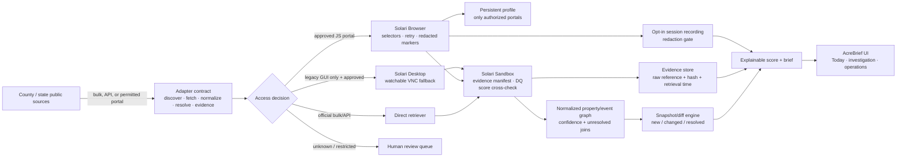

# Solari architecture

## Locked goal

Use Solari to make a real Lee County property-distress investigation observable, evidence-backed, and resilient—not to add an unrelated browser demo.

## Capability findings

**Observation (verified in this fork’s upstream examples):** Solari Browser supports cloud browser sessions; a browser profile stores cookies/local storage server-side and requires an explicit save; recording is enabled per session and replay availability can lag release. Sandbox provides an isolated microVM/code-interpreter shape and supports snapshot-based warm work. Desktop provides screenshot/click/type computer use with a live VNC stream. See the upstream [README](../README.md) and `examples/browser-profiles-ts`, `examples/browser-session-recording-py`, `examples/sandbox-*`, and `examples/desktop-computer-use-py`.

**Inference:** County portals are fragmented and often JavaScript-heavy. A single investigation needs an environment that can navigate a permitted portal, retain a lawful authenticated session only when necessary, capture what was observed, and isolate risky document processing.

**Unknown:** Per-source automation permissions, rate limits, robots directives, and which county portals will remain stable are not assumed from public accessibility. The source registry makes these gates explicit.

## Why each surface exists

| Solari surface | Job in AcreBrief | Guardrails | Current use |
| --- | --- | --- | --- |
| Browser | Read an explicitly approved public portal, preserve privacy-safe page-presence evidence, and verify exact redacted case/property markers | No CAPTCHA/access-control bypass; access token; single concurrency; default-deny source allow-list; property pages unrecorded | SDK/account smoke passed against `example.com`; Lee source-specific run remains approval-gated |
| Sandbox | Validate source-native IDs/evidence counts and independently cross-check the numeric score | No customer secrets in outputs; serialized input; resource/time caps | SDK/account command smoke passed; live-run quality gate compiles; PDF parsing remains future adapter work |
| Desktop | Last-resort computer-use for a legitimate GUI-only government interface | Requires source approval; visible operator context; never used merely to satisfy a demo or bypass browser restrictions | Deliberately not enabled by default |
| Persistent profile | Reuse a lawfully authenticated session without putting cookies in the app/database | Explicit owner consent; encrypted provider storage; profile ID is secret; explicit save; deletion policy | Design supported; disabled until a permitted source requires it |
| Recording | Let a reviewer see what the agent did and bind a run to its collection sequence | Explicit per-session opt-in; asynchronous retrieval; review/redaction before public sharing | Enabled only for safe demo/approved sessions |
| Snapshot | Start processing fast and consistently | Snapshot provenance/version must be retained; no claim that a snapshot is source truth | Supported by Solari, not enabled in the current slice |

## Adapter contract and failure posture

Every source implements a bounded version of `discover(window)`, `fetch(ref)`, `normalize(raw)`, `resolve(record)`, `evidence(record)`, and `healthcheck()`. It emits normalized events plus raw evidence metadata, never an asserted parcel match without confidence.

An adapter failure produces a source-health event and a partial run. It cannot erase old evidence, promote a score, or re-alert unchanged facts. Selector/schema drift is detected by expected-field checks; it routes to review rather than guessing.

## Cost and safety decisions

Reuse one scoped Browser session for related reads; favor official bulk data; batch Sandbox parsing; cache immutable document references; and record exactly the run status/usage needed for unit economics. See [unit economics](UNIT_ECONOMICS.md) and [security](SECURITY.md).
