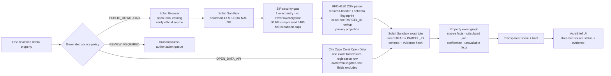

# Solari architecture

## Locked goal

Use Solari to make a real Lee County property-distress investigation observable, evidence-backed, and safe: current Florida DOR data first, exact municipal event resolution second, and no ambiguous publisher automation in the critical path.

## Current live architecture

## Why each Solari surface exists

| Surface | Job | Current evidence | Guardrails |
| --- | --- | --- | --- |
| Browser | visibly navigate and identity-check the official DOR catalog before processing its published artifact | a real September 1 run opened the DOR catalog and passed exact final-origin/path and title checks | non-recorded; one page; no property/person content; no CAPTCHA/auth bypass |
| Sandbox | isolate untrusted bulk-data handling and prove the exact join independently of the web server | real run downloaded the 43.3 MB ZIP, safely expanded the 285.7 MB CSV, projected one parcel, hashed the archive and full observed schema, and validated the City→DOR join | archive entry/size/encryption/path checks; required unique headers; exact-one parcel; owner/mailing discarded; VM killed on abort and in `finally` |
| Desktop | legitimate fallback for an approved GUI-only government system | not used; both current sources have better structured routes | never force Desktop for optics or use it to evade access controls |
| Persistent profile | reuse an explicitly authorized login | not needed; current sources are unauthenticated | profile IDs/secrets never enter app data or git; future use requires consent/deletion lifecycle |
| Recording | optional judge/operator replay | provider capability confirmed by upstream example; disabled in AcreBrief | retention/deletion and application redaction/review controls are not implemented; generic app demo video is used instead |
| Snapshot | warm repeatable parsing environment | supported by Solari; not yet enabled | future cache must record template/schema/source revision and cannot masquerade as current source state |

## Why this is materially Solari-native

The direct City API call is deliberately not forced through a browser. Solari is used where it changes the operational shape:

- a judge can watch source-by-source progress rather than trust an opaque batch job;
- a large untrusted government archive is processed outside the web server;
- the Sandbox independently enforces schema, join, and evidence-manifest invariants;
- source failures become isolated streamed status rather than a partially fabricated brief;
- Browser and Sandbox run references are one-way hashes, not provider session credentials.

The first live run caught a real environment mismatch: the base Sandbox lacks the `unzip` binary. The adapter failed closed, then was corrected to use Python's standard-library ZIP reader with explicit safety checks. The subsequent real run completed end-to-end in roughly 46 seconds. This is runtime proof, not a mocked green check.

## Source policy and adapter boundary

Adapter preference:

1. official API/bulk/public download;
2. lawful direct structured retrieval;
3. Solari Browser for an approved interactive portal;
4. Solari Desktop for an approved GUI-only source;
5. review queue.

The registry's `access_basis` is compiled into runtime policy. `APPROVED` additionally requires exact HTTPS URLs, reviewer, terms date, expiry, and a positive request budget. Environment variables cannot override a `REVIEW_REQUIRED` source.

Each normalized event uses a source-native stable fingerprint. City lien rows are not keyed by ObjectID alone because the service exhibits duplicate/repeated object values; the event fingerprint includes trimmed STRAP, lien reference, source date, amount, active state, and release state.

## Privacy and fact semantics

The DOR archive contains owner/mailing columns and the City schema contains account/customer/name/service-address columns. AcreBrief reads the bulk archive in the Sandbox but emits only named parcel/property fields. The City query excludes sensitive/unnecessary columns at the request boundary.

The UI labels:

- DOR parcel/assessment values and City status as **source facts**;
- the exact STRAP/PARCEL_ID match as **calculated**;
- no current behavioral inference;
- court, foreclosure, tax balance, lien priority/payoff, equity, title, and seller intent as **unavailable**.

## Cost and reliability

The current one-property competition route combines process-local single concurrency/cooldown with a published Vercel WAF rule limiting `POST /api/investigations` to one request per 60 seconds per IP+JA4 key. Vercel documents WAF counters as regional, so this is stronger bounded-demo protection but not a durable global quota. Worst-case physical request budgets are DOR 4 (one catalog visit + three bounded archive attempts) and City 2 (one query + one transient retry); every attempt consumes and is capped by the generated policy. Redirects are not followed, and stream cancellation triggers remote cleanup with a second cancellation check after each remote resource is created. The 43 MB DOR archive should move to revision-keyed object/cache storage and an atomic global quota before multi-user scale; downloading it per investigation is intentional only for the competition's visible proof. See [unit economics](UNIT_ECONOMICS.md).
